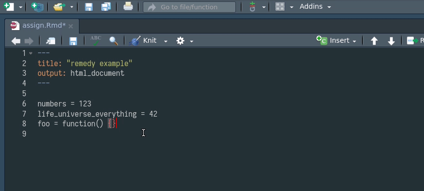
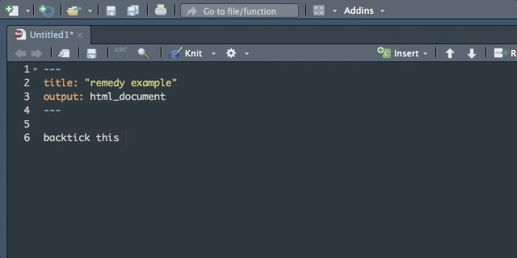
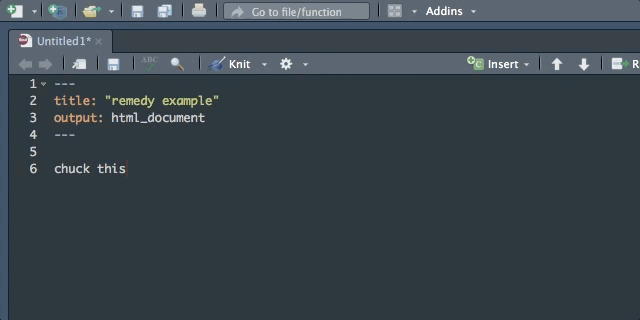
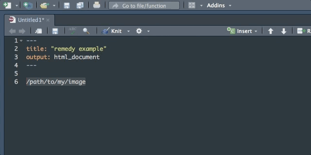
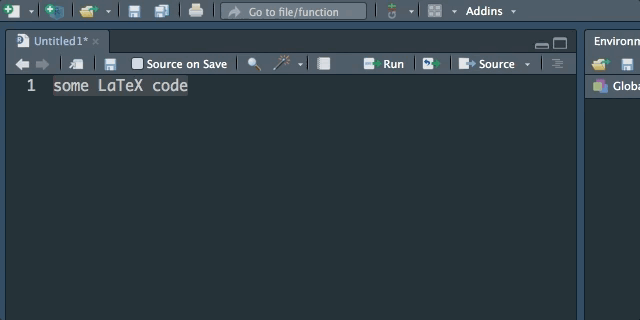
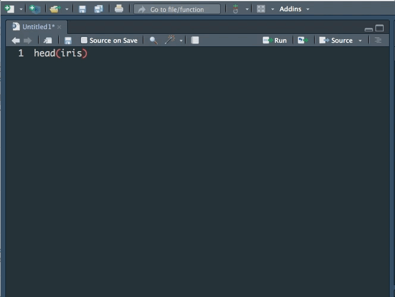
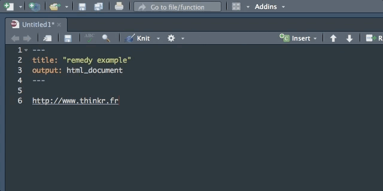
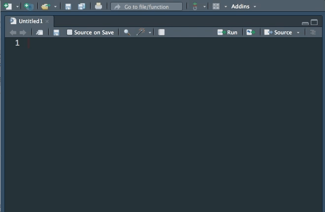

<!-- README.md is generated from README.Rmd. Please edit that file -->
[](https://travis-ci.org/ThinkR-open/remedy)[](https://codecov.io/github/ThinkR-open/remedy?branch=master)[](https://github.com/ThinkR-open/remedy/tree/master/tests/README.md)

remedy
======

`{remedy}` provides addins to facilitate writing in markdown with
RStudio.


All the functions are meant to be mapped to keyboard shortcuts. A list
of suggested shortcuts is provided towards the end of this README.

> Note that most of the addins/shortcuts below will also work without
> selecting any text.

Install
-------

``` r
devtools::install_github("ThinkR-open/remedy")
```

Once you’ve installed the package, you don’t need to load it with
`library()`, the addins are installed on your machine as part of the
package install process.

Using `{remedy}`
----------------

Write quicker in markdown with `{remedy}`!

Here’s a list of all available helpers:


### Align

Align selected blocks to their assignment operator, either `<-`


or `=`



### Backtick

Enclose the selected word(s) in backticks.



### Chunk

Turn the selected text into a chunk.



### Emphasize

Embolden, italicize or strikethrough the selected text.


### Headers

Turn the selected text into a header.


### Image

Turn the selected path into an image.

This element is context aware: if you select a text and a link, it turns
the text into title between `![]`, and puts the link between `()`.

If the last element of the selection is not a link, you get an error
message straight into you markdown document.



### LaTeX

LaTeX syntax :



### List

Turn the selected text into an unordered list.


### Moving

#### On the right

Copy the selected text or the current line to the right.


### Table

Insert a table inside your doc.

There are basically two way to do that with remedy :

#### Empty table


#### Parse your data

Turn your dataframe into a markdown table :



### URL

Turn the selected text into an url.

This element is context aware: if you select a text and a link, it turns
the text into title between `[]`, and puts the link between `()`.

If the last element of the selection is not a link, you get an error
message straight into you markdown document.



### xaringan

Insert a xaringan pull-left and pull-right template.



Recommended shortcuts (macOS)
-----------------------------

Here’s a list of recommended shortcuts:

``` r
remedy::remedy_opts$get('hotkeys')
#>           backtick               bold              chunk 
#>       "Ctrl+Cmd+`"       "Ctrl+Cmd+B"   "Ctrl+Alt+Cmd+C" 
#>         chunksplit                 h1                 h2 
#> "Ctrl+Shift+Alt+C"       "Ctrl+Cmd+1"       "Ctrl+Cmd+2" 
#>                 h3                 h4                 h5 
#>       "Ctrl+Cmd+3"       "Ctrl+Cmd+4"       "Ctrl+Cmd+5" 
#>                 h6        htmlcomment              image 
#>       "Ctrl+Cmd+6"       "Ctrl+Alt+C"       "Ctrl+Cmd+P" 
#>            italics              latex               list 
#>       "Ctrl+Cmd+I"       "Ctrl+Cmd+L" "Ctrl+Shift+Cmd+=" 
#>              right             strike              table 
#>    "Alt+Cmd+Right"       "Ctrl+Cmd+S"       "Ctrl+Cmd+T" 
#>                url           xaringan            youtube 
#>       "Ctrl+Cmd+U"       "Ctrl+Cmd+X"       "Ctrl+Cmd+Y"
```

### Managing Shortcuts

Use the [`{rsam}`](https://github.com/yonicd/rsam) package to set and
manage for you the hotkey settings of `{remedy}`.

If you want to edit the default settings you can view the defaults
`remedy_opts$get('hotkeys')` and change them through
`remedy_opts$set(hotkeys=<NEW_SETTINGS>)`.

``` r
hotkeys <- remedy::remedy_opts$get("hotkeys")
rsam::set_shortcut(sprintf('remedy::%sr',names(hotkeys)), hotkeys)
```

Feedback and enhancement
------------------------

You’ve found a bug, or have an enhancement idea? Feel free to open an
issue : <https://github.com/ThinkR-open/remedy/issues>.
